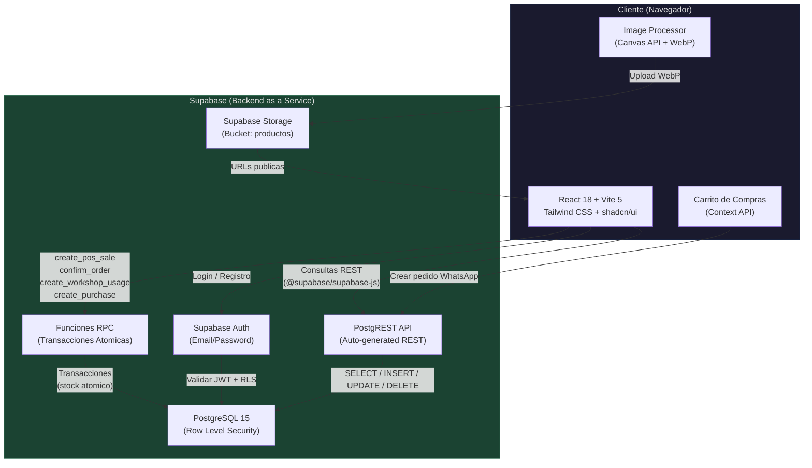
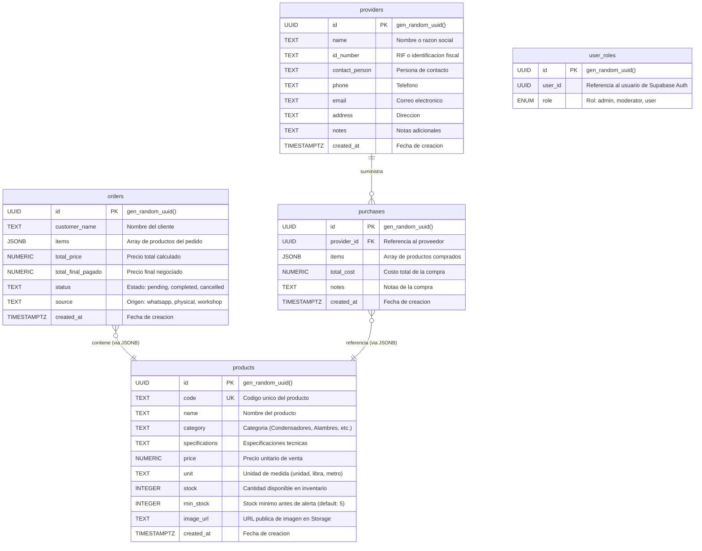
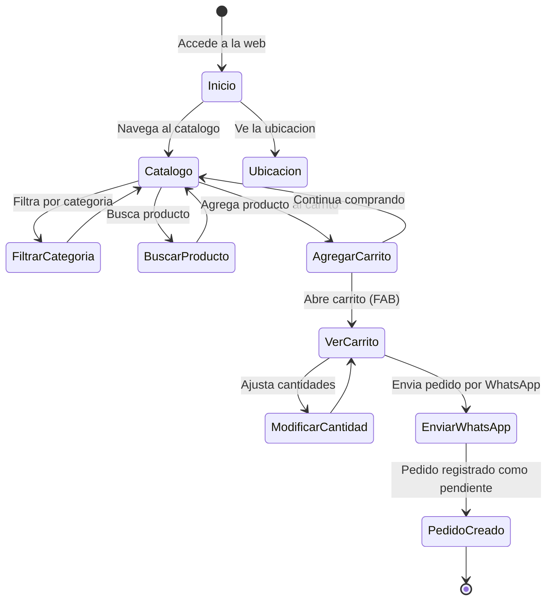
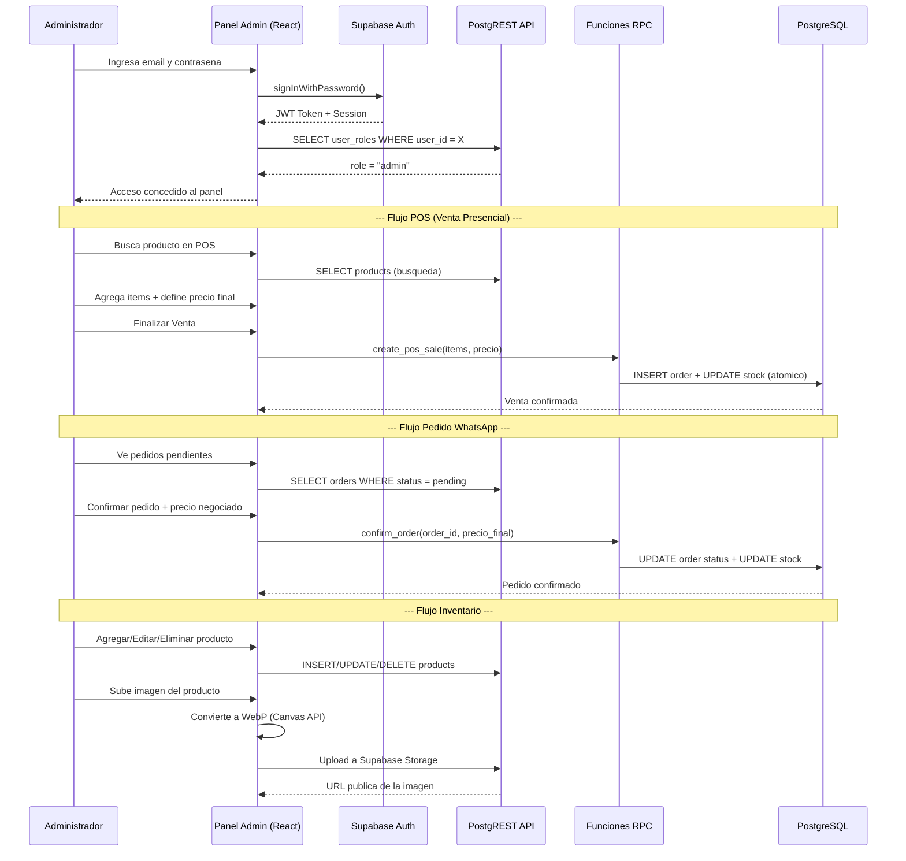
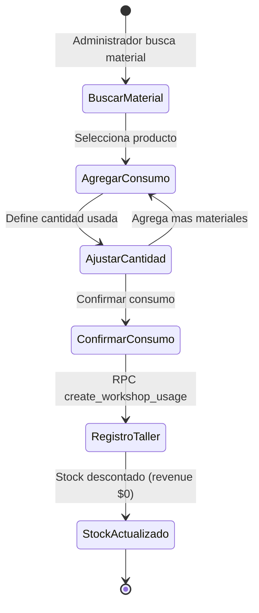

# Electroinsumos: Smart ERP & AI Inventory Suite


**Electroinsumos** es una plataforma integral de gestion empresarial (ERP) disenada para negocios de suministros electricos que operan en ventas directas, e-commerce via WhatsApp y servicios de taller. El sistema optimiza la operatividad mediante procesamiento inteligente de imagenes, un dashboard basado en semaforos de prioridad y una arquitectura mobile-first altamente ergonomica.

---

## Tabla de Contenidos

- [Descripcion General del Sistema](#descripcion-general-del-sistema)
- [Diagrama de Arquitectura](#diagrama-de-arquitectura)
- [Tecnologias Utilizadas](#tecnologias-utilizadas)
- [Diagrama de Base de Datos](#diagrama-de-base-de-datos)
- [Instalacion y Despliegue](#instalacion-y-despliegue)
- [Estructura del Proyecto](#estructura-del-proyecto)
- [Flujo de Usuario](#flujo-de-usuario)
- [Guia de Uso - API y Operaciones CRUD](#guia-de-uso---api-y-operaciones-crud)
- [Autores y Agradecimientos](#autores-y-agradecimientos)

---

## Descripcion General del Sistema

Electroinsumos resuelve la problematica de gestion manual e ineficiente que enfrentan los negocios de suministros electricos en Ecuador. Estos negocios manejan simultaneamente un inventario extenso de componentes (condensadores, rodamientos, alambres, sellos mecanicos, etc.), ventas en mostrador, pedidos por WhatsApp y consumo interno de materiales en taller de reparaciones.

### Problema que Resuelve

| Problema | Solucion Electroinsumos |
|---|---|
| Control de inventario manual en papel o Excel | Dashboard digital con semaforo de stock (rojo/naranja/verde) |
| Imagenes de productos inconsistentes y pesadas | Pipeline de procesamiento: conversion WebP + optimizacion automatica |
| Falta de trazabilidad en ventas de mostrador | Modulo POS con descuento atomico de stock via funciones RPC |
| Consumo de taller no registrado | Modulo Workshop con registro de materiales usados (revenue $0) |
| Reportes manuales mensuales | Triple reporte CSV con membrete corporativo automatizado |
| Sin gestion de proveedores ni compras | Modulos CRUD de proveedores y registro de compras con incremento de stock |

### Pilares Funcionales

- **Dashboard Inteligente (Semaforo):** Monitoreo en tiempo real con tres niveles: critico (rojo), advertencia (naranja) y seguro (verde).
- **Punto de Venta (POS):** Registro de ventas presenciales con busqueda de productos, ajuste de precios y descuento atomico de stock.
- **Catalogo Publico:** Vitrina de productos con filtrado por categoria, busqueda y paginacion, accesible sin autenticacion.
- **Gestion de Pedidos WhatsApp:** Carrito de compras publico con envio de pedidos via WhatsApp y confirmacion administrativa posterior.
- **Consumo de Taller:** Registro de materiales utilizados en reparaciones internas sin generar revenue.
- **Gestion de Proveedores y Compras:** CRUD de proveedores y registro de compras con incremento automatico de stock.
- **Reportes con Membrete:** Exportacion CSV de ventas, consumo de taller e inventario con encabezado corporativo.
- **Procesamiento de Imagenes:** Conversion automatica a WebP con optimizacion de tamano y subida a Supabase Storage.

---

## Diagrama de Arquitectura



### Flujo de Datos

1. **Cliente Publico:** El usuario navega el catalogo, agrega productos al carrito y envia el pedido por WhatsApp. No requiere autenticacion.
2. **Administrador:** Se autentica via Supabase Auth, el sistema verifica el rol `admin` en la tabla `user_roles`, y habilita el panel completo.
3. **Transacciones Atomicas:** Las operaciones criticas (venta POS, confirmacion de pedido, consumo de taller, registro de compra) se ejecutan mediante funciones RPC en PostgreSQL para garantizar consistencia de stock.
4. **Imagenes:** El componente `ImageProcessor` convierte la imagen a WebP en el navegador, la sube a Supabase Storage y almacena unicamente la URL publica en la base de datos.

---

## Tecnologias Utilizadas

### Frontend

| Tecnologia | Version | Proposito |
|---|---|---|
| **React** | 18.3 | Biblioteca principal de UI con componentes funcionales y hooks |
| **Vite** | 5.4 | Bundler y servidor de desarrollo con HMR ultrarapido |
| **TypeScript** | 5.8 | Tipado estatico para mayor robustez del codigo |
| **Tailwind CSS** | 3.4 | Framework de estilos utility-first con enfoque mobile-first |
| **shadcn/ui (Radix)** | Latest | Componentes accesibles y estilizados (Dialog, Select, Toast, etc.) |
| **React Router DOM** | 6.30 | Enrutamiento SPA con rutas publicas y protegidas |
| **TanStack React Query** | 5.83 | Cache y sincronizacion de estado del servidor |
| **Recharts** | 2.15 | Graficos y visualizaciones para el dashboard |
| **Lucide React** | 0.462 | Biblioteca de iconos SVG consistente |
| **Zod** | 3.25 | Validacion de esquemas para formularios |
| **React Hook Form** | 7.61 | Gestion de formularios con validacion integrada |

### Backend y Base de Datos

| Tecnologia | Proposito |
|---|---|
| **Supabase** | Backend as a Service (Auth, REST API, Storage, Realtime) |
| **PostgreSQL** | Base de datos relacional con Row Level Security (RLS) |
| **PostgREST** | API REST auto-generada desde el esquema de PostgreSQL |
| **Funciones RPC** | Procedimientos almacenados para transacciones atomicas de stock |
| **Supabase Storage** | Almacenamiento de objetos para imagenes de productos (bucket `productos`) |

### Herramientas de Desarrollo

| Herramienta | Proposito |
|---|---|
| **Lovable** | Plataforma de generacion de frontend asistida por IA |
| **ESLint** | Linter para JavaScript/TypeScript |
| **Vitest** | Framework de testing unitario compatible con Vite |
| **PostCSS + Autoprefixer** | Procesamiento de CSS con prefijos automaticos |

---

## Diagrama de Base de Datos



### Funciones RPC (Transacciones Atomicas)

| Funcion | Parametros | Descripcion |
|---|---|---|
| `create_pos_sale` | `p_customer_name`, `p_items`, `p_final_price` | Crea una orden POS y descuenta stock atomicamente |
| `confirm_order` | `p_order_id`, `p_final_price` | Confirma un pedido WhatsApp pendiente y descuenta stock |
| `create_workshop_usage` | `p_items` | Registra consumo de taller (source: workshop, revenue: $0) |
| `create_purchase` | `p_provider_id`, `p_items`, `p_total_cost`, `p_notes` | Registra compra e incrementa stock atomicamente |
| `has_role` | `_user_id`, `_role` | Verifica si un usuario tiene un rol especifico |

### Politicas de Seguridad (RLS)

- **products:** Lectura publica (`SELECT` para todos). Escritura restringida a usuarios con rol `admin`.
- **orders:** Insercion publica (checkout de carrito). Lectura y modificacion solo para `admin`.
- **providers / purchases:** CRUD completo restringido a `admin`.
- **user_roles:** Solo lectura para `admin`.
- **Storage (bucket `productos`):** Lectura publica. Subida, actualizacion y eliminacion restringidas a `admin`.

---

## Instalacion y Despliegue

### Requisitos Previos

| Requisito | Version Minima | Descripcion |
|---|---|---|
| **Node.js** | 18.0+ | Entorno de ejecucion JavaScript |
| **npm** | 9.0+ | Gestor de paquetes (incluido con Node.js) |
| **Git** | 2.30+ | Control de versiones |
| **Cuenta Supabase** | - | Backend as a Service (gratuito disponible) |

### Paso a Paso

1. **Clonar el repositorio**

```bash
git clone https://github.com/Mateo-1402/electroinsumos.git
cd electroinsumos
```

2. **Instalar dependencias**

```bash
npm install
```

3. **Configurar variables de entorno**

Crear un archivo `.env` en la raiz del proyecto con las siguientes variables:

```env
# .env.example
VITE_SUPABASE_PROJECT_ID="tu-project-id"
VITE_SUPABASE_PUBLISHABLE_KEY="tu-anon-key"
VITE_SUPABASE_URL="https://tu-project-id.supabase.co"
```

> **Nota:** Obtener las credenciales desde el dashboard de Supabase en **Settings > API**.

4. **Configurar la base de datos en Supabase**

Ejecutar las migraciones SQL en orden desde la carpeta `supabase/migrations/` en el editor SQL de Supabase:

```bash
# Las migraciones se encuentran en:
ls supabase/migrations/
```

Ejecutar cada archivo `.sql` en el **SQL Editor** del dashboard de Supabase, respetando el orden cronologico de los nombres de archivo.

5. **Crear el usuario administrador**

En el dashboard de Supabase:
- Ir a **Authentication > Users** y crear un usuario con email y contrasena.
- En el **SQL Editor**, insertar el rol de administrador:

```sql
INSERT INTO public.user_roles (user_id, role)
VALUES ('<UUID-del-usuario-creado>', 'admin');
```

6. **Crear el bucket de Storage**

> **Nota:** La migracion `20260212152406_*.sql` crea automaticamente el bucket `productos`. Verificar en **Storage** que exista y sea publico.

7. **Ejecutar el servidor de desarrollo**

```bash
npm run dev
```

La aplicacion estara disponible en `http://localhost:8080`.

8. **Compilar para produccion**

```bash
npm run build
```

Los archivos optimizados se generan en la carpeta `dist/`.

9. **Ejecutar tests**

```bash
npm run test
```

---

## Estructura del Proyecto

```
electroinsumos/
├── public/                          # Archivos estaticos publicos
├── src/
│   ├── components/                  # Componentes React reutilizables
│   │   ├── ui/                      # Componentes base de shadcn/ui (Button, Input, Dialog, etc.)
│   │   ├── AdminDashboard.tsx       # Dashboard con KPIs y semaforo de stock
│   │   ├── AdminInventory.tsx       # CRUD completo de productos con filtros y busqueda
│   │   ├── AdminPOS.tsx             # Punto de Venta presencial con descuento de stock
│   │   ├── AdminOrders.tsx          # Gestion de pedidos WhatsApp (confirmar/cancelar)
│   │   ├── AdminSalesHistory.tsx    # Historial de ventas completadas
│   │   ├── AdminWorkshop.tsx        # Registro de consumo de materiales en taller
│   │   ├── AdminProviders.tsx       # CRUD de proveedores
│   │   ├── AdminPurchases.tsx       # Registro de compras con incremento de stock
│   │   ├── AdminReports.tsx         # Exportacion de reportes CSV con membrete
│   │   ├── ImageProcessor.tsx       # Pipeline de procesamiento de imagenes (WebP)
│   │   ├── CartFAB.tsx              # Boton flotante del carrito de compras
│   │   ├── WhatsAppFAB.tsx          # Boton flotante de WhatsApp
│   │   ├── ProductCard.tsx          # Tarjeta de producto para el catalogo
│   │   ├── WireProductCard.tsx      # Tarjeta de producto con variantes (calibres/medidas)
│   │   ├── CategoryCombobox.tsx     # Combobox de categorias con autocompletado
│   │   ├── Navbar.tsx               # Barra de navegacion publica
│   │   ├── Footer.tsx               # Pie de pagina
│   │   └── NavLink.tsx              # Enlace de navegacion activo
│   ├── contexts/
│   │   └── CartContext.tsx           # Context API para el carrito de compras
│   ├── hooks/
│   │   ├── use-mobile.tsx           # Hook para detectar dispositivos moviles
│   │   └── use-toast.ts             # Hook para notificaciones toast
│   ├── integrations/
│   │   └── supabase/
│   │       ├── client.ts            # Cliente Supabase inicializado
│   │       └── types.ts             # Tipos TypeScript auto-generados del esquema DB
│   ├── lib/
│   │   ├── utils.ts                 # Utilidades generales (cn, etc.)
│   │   └── validation.ts            # Esquemas de validacion Zod
│   ├── pages/
│   │   ├── Index.tsx                # Pagina de inicio (landing)
│   │   ├── Catalog.tsx              # Catalogo publico con filtros y paginacion
│   │   ├── Location.tsx             # Pagina de ubicacion del negocio
│   │   ├── Admin.tsx                # Panel de administracion (login + sidebar + modulos)
│   │   └── NotFound.tsx             # Pagina 404
│   ├── test/                        # Archivos de configuracion de tests
│   ├── App.tsx                      # Componente raiz con rutas y proveedores
│   ├── App.css                      # Estilos globales de la aplicacion
│   ├── main.tsx                     # Punto de entrada de React
│   └── index.css                    # Estilos base de Tailwind CSS
├── supabase/
│   ├── config.toml                  # Configuracion local de Supabase CLI
│   └── migrations/                  # Migraciones SQL en orden cronologico
│       ├── 20260211..._products.sql           # Tabla products + seed data
│       ├── 20260212..._rls_policies.sql       # Politicas RLS basadas en roles
│       ├── 20260212..._storage_bucket.sql     # Bucket de Storage para imagenes
│       ├── 20260213..._orders.sql             # Tabla orders + politicas
│       ├── 20260214..._roles_rpc.sql          # Enum app_role + user_roles + RPC confirm_order
│       ├── 20260214..._fix_policies.sql       # Correccion de politicas de roles
│       ├── 20260217..._storage_admin.sql      # Storage restringido a admin
│       ├── 20260218..._order_validation.sql   # Validacion mejorada de orders
│       ├── 20260226..._pos_sale.sql           # Columna source + RPC create_pos_sale
│       ├── 20260305..._workshop.sql           # RPC create_workshop_usage
│       ├── 20260305..._min_stock.sql          # Columna min_stock en products
│       └── 20260311..._providers.sql          # Tablas providers + purchases + RPC
├── .env                             # Variables de entorno (no commitear en produccion)
├── .gitignore                       # Archivos ignorados por Git
├── components.json                  # Configuracion de shadcn/ui
├── eslint.config.js                 # Configuracion de ESLint
├── index.html                       # HTML principal (punto de entrada de Vite)
├── package.json                     # Dependencias y scripts npm
├── postcss.config.js                # Configuracion de PostCSS
├── tailwind.config.ts               # Configuracion de Tailwind CSS (tema personalizado)
├── tsconfig.json                    # Configuracion base de TypeScript
├── tsconfig.app.json                # Configuracion TS para la aplicacion
├── tsconfig.node.json               # Configuracion TS para el entorno Node
├── vite.config.ts                   # Configuracion de Vite (aliases, puerto 8080)
└── vitest.config.ts                 # Configuracion de Vitest para testing
```

---

## Flujo de Usuario

### Flujo del Cliente Publico (Catalogo + Carrito + WhatsApp)



### Flujo del Administrador (Panel de Gestion)



### Flujo de Consumo de Taller



---

## Guia de Uso - API y Operaciones CRUD

Todas las operaciones se realizan a traves del cliente Supabase (`@supabase/supabase-js`). A continuacion se documentan los patrones principales de interaccion con cada modulo.

### Productos (CRUD Completo)

```typescript
import { supabase } from "@/integrations/supabase/client";

// Listar todos los productos ordenados por stock
const { data } = await supabase
  .from("products")
  .select("*")
  .order("stock", { ascending: true });

// Crear un nuevo producto
const { error } = await supabase.from("products").insert({
  code: "EI-CDA-500",
  name: "Condensador de Arranque",
  category: "Condensadores",
  specifications: "500 MFD / 250V",
  price: 15.00,
  unit: "unidad",
  stock: 20,
  min_stock: 5,
  image_url: null,
});

// Actualizar un producto existente
const { error } = await supabase
  .from("products")
  .update({ stock: 25, price: 16.50 })
  .eq("id", "<product-uuid>");

// Eliminar un producto
const { error } = await supabase
  .from("products")
  .delete()
  .eq("id", "<product-uuid>");
```

### Punto de Venta (POS) - Transaccion Atomica

```typescript
// Crear venta POS (descuenta stock automaticamente)
const items = [
  { id: "<product-uuid>", name: "Condensador", specifications: "500 MFD", quantity: 2, price: 15.00 },
];

const { error } = await supabase.rpc("create_pos_sale", {
  p_customer_name: "Cliente Mostrador",
  p_items: items,
  p_final_price: 30.00,
});
```

### Pedidos WhatsApp

```typescript
// Crear pedido (publico, sin autenticacion)
const { error } = await supabase.from("orders").insert({
  customer_name: "Juan Perez",
  items: [{ id: "...", name: "Rodamiento 6203", quantity: 2, price: 6.50 }],
  total_price: 13.00,
  source: "whatsapp",
});

// Confirmar pedido (admin, con descuento de stock atomico)
const { error } = await supabase.rpc("confirm_order", {
  p_order_id: "<order-uuid>",
  p_final_price: 12.00,
});
```

### Consumo de Taller

```typescript
// Registrar consumo de materiales (source: workshop, revenue: $0)
const { error } = await supabase.rpc("create_workshop_usage", {
  p_items: [
    { id: "<product-uuid>", name: "Alambre Calibre 18", specifications: "AWG 18", quantity: 3, price: 0 },
  ],
});
```

### Proveedores (CRUD Completo)

```typescript
// Listar proveedores
const { data } = await supabase.from("providers").select("*").order("name");

// Crear proveedor
const { error } = await supabase.from("providers").insert({
  name: "Distribuidora Electrica Nacional",
  id_number: "1791234567001",
  contact_person: "Carlos Lopez",
  phone: "0991234567",
  email: "ventas@den.com.ec",
  address: "Quito, Ecuador",
  notes: "Proveedor principal de condensadores",
});
```

### Compras (con Incremento de Stock)

```typescript
// Registrar compra (incrementa stock automaticamente)
const { error } = await supabase.rpc("create_purchase", {
  p_provider_id: "<provider-uuid>",
  p_items: [
    { id: "<product-uuid>", name: "Rodamiento 6205", specifications: "NTN", quantity: 50, cost_per_unit: 5.00 },
  ],
  p_total_cost: 250.00,
  p_notes: "Pedido mensual de rodamientos",
});
```

### Reportes CSV

Los reportes se generan en el frontend y se descargan directamente al navegador. No requieren endpoint backend. Se exportan tres tipos:

| Reporte | Fuente de Datos | Formato |
|---|---|---|
| **Ventas** | `orders` con status `completed` y source `whatsapp` o `physical` | CSV con columnas: Fecha, Cliente, Fuente, Precio Original, Precio Final, Items |
| **Consumo de Taller** | `orders` con status `completed` y source `workshop` | CSV con columnas: Fecha, Items, Total Unidades |
| **Inventario** | `products` ordenados por stock ascendente | CSV con columnas: Codigo, Nombre, Categoria, Especificaciones, Precio, Stock, Unidad, Stock Minimo, Valoracion, Estado (semaforo) |

---

## Autores y Agradecimientos

### Autor Principal

**Mateo Rodriguez**
Estudiante de Ingenieria en Computacion - Universidad Internacional SEK (UISEK)
Quito, Ecuador

### Creditos

- **Lovable** - Plataforma de desarrollo frontend asistida por IA.
- **Supabase** - Backend as a Service para autenticacion, base de datos y almacenamiento.
- **shadcn/ui** - Componentes de UI accesibles construidos sobre Radix UI.
- **Tailwind CSS** - Framework de estilos utility-first.
- **Lucide Icons** - Biblioteca de iconos SVG.

---

## Licencia

Este proyecto es de uso privado para **Electroinsumos**. Todos los derechos reservados.
